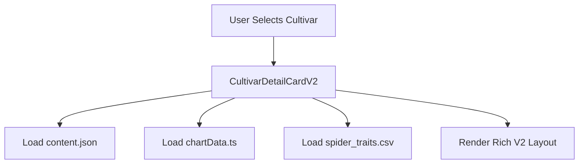

# CBC Cultivar Explorer - Complete Architecture Guide

## 🌟 Global Architecture Overview
This is a **California Berry Cultivars Explorer** - a responsive Next.js web application for comparing strawberry cultivars with performance charts, filtering, and data-driven CSV loading. The app is designed to be scalable to 9+ cultivars while maintaining clean, maintainable code.

## 🎨 Global Themes & Design System

### Visual Identity
- **Futuristic/sci-fi aesthetic** with glass morphism effects
- **Green primary theme** (`#00ff88`, `#22c55e`) for CBC branding  
- **Dark background** with translucent glass panels
- **Holographic effects** - sweeping animations, edge glows, data streams
- **Premium button styles** with gradient backgrounds and drop shadows

### Color Palette
```css
--primary-green: #00ff88
--secondary-green: #22c55e  
--accent-cyan: #00ffff
--background-dark: rgba(17, 24, 39, 0.9)
--glass-border: rgba(255, 255, 255, 0.1)
--text-primary: #ffffff
--text-secondary: #9CA3AF
```

### Component Styling Patterns
- **Glass morphism**: `backdrop-filter: blur(10px) saturate(180%)`
- **Modern cards**: Rounded corners (20px), subtle shadows, hover effects
- **Gradient buttons**: Multiple color gradients based on cultivar/function
- **Responsive typography**: System fonts with appropriate weight hierarchy

### Device-Responsive Design
- **Mobile**: Vertical stack layout with drawers
- **Desktop**: Two-column layout with right filter panel
- **Landscape Mobile**: Optimized spacing and header heights

## 🏗️ App Architecture: Two View Systems

## View System Architecture

The CBC Cultivar Explorer uses a **single unified view system**:

### CultivarDetailCardV2 (Primary View)
- **Rich marketing layout** with data-driven content
- **Banner images** and **photo carousels**
- **Performance metrics** and **recommendations**
- **Comparison charts** with cultivar selectors
- **Content loaded** from `/public/data/cultivars/{id}/content.json`

**All cultivars use this rich V2 layout** - no fallback needed!

## 📁 Folder Structure & File Organization

### **Complete Directory Structure**
```
cbc-cultivar-explorer/
├── app/
│   └── page.tsx                          # Main app logic, view selection
├── components/
│   ├── TopNav.tsx                       # Navigation header
│   ├── CultivarDetailCardV2.tsx         # Rich marketing layout (primary view)
│   ├── CultivarChart.tsx                # Performance comparison charts  
│   ├── SpiderChart.tsx                  # Trait radar charts
│   ├── CultivarSelector.tsx             # Chart cultivar selection UI
│   └── CultivarFilterPanel.tsx          # Filter controls sidebar
├── data/
│   ├── cultivars.ts                      # Primary cultivar registry
│   ├── chartData.ts                      # Performance chart data
│   ├── cultivarContent.ts                # Content loading logic
│   └── infoOverlayContent.ts             # Info overlay system
├── public/
│   ├── data/
│   │   ├── cultivars/
│   │   │   ├── {cultivar-id}/
│   │   │   │   └── content.json          # Rich content data
│   │   │   ├── alturas/content.json
│   │   │   ├── adelanto/content.json
│   │   │   ├── alhambra/content.json
│   │   │   ├── artesia/content.json
│   │   │   ├── belvedere/content.json
│   │   │   └── castaic/content.json
│   │   └── csv/
│   │       └── spider_traits.csv         # Spider chart data
│   └── images/
│       ├── icons/
│       │   ├── {cultivar}_card_icon.png  # Card icons (95px mobile, 130px desktop)
│       │   ├── adelanto_card_icon.png
│       │   ├── alhambra_card_icon.png
│       │   ├── alturas_card_icon.png
│       │   ├── artesia_card_icon.png
│       │   ├── belvedere_card_icon.png
│       │   ├── brisbane_card_icon.png
│       │   ├── carpinteria_card_icon.png
│       │   ├── castaic_card_icon.png
│       │   └── sweetcarolina_card_icon.png
│       └── cultivars/
│           └── {cultivar-id}/
│               ├── banner.jpg            # 3:1 aspect ratio marketing banner
│               ├── {cultivar}_1.jpg      # Carousel image 1
│               ├── {cultivar}_2.jpg      # Carousel image 2
│               └── {cultivar}_3.jpg      # Carousel image 3
```

### **File Path Examples**
```bash
# Content Data
public/data/cultivars/castaic/content.json

# Images  
public/images/icons/castaic_card_icon.png
public/images/cultivars/castaic/banner.jpg
public/images/cultivars/castaic/castaic_1.jpg
public/images/cultivars/castaic/castaic_2.jpg
public/images/cultivars/castaic/castaic_3.jpg

# Chart Data
public/data/csv/spider_traits.csv
data/chartData.ts
```

### **Content.json Structure**
```json
{
  "id": "cultivar-id",
  "name": "Cultivar Name",
  "displayName": "Cultivar™",
  "type": "day-neutral" | "short-day" | "summer-plant-day-neutral",
  "description": {
    "title": "Marketing Title",
    "paragraphs": ["Marketing paragraph 1", "Marketing paragraph 2"]
  },
  "images": {
    "banner": "/images/cultivars/{cultivar-id}/banner.jpg",
    "carousel": [
      "/images/cultivars/{cultivar-id}/{cultivar}_1.jpg",
      "/images/cultivars/{cultivar-id}/{cultivar}_2.jpg",
      "/images/cultivars/{cultivar-id}/{cultivar}_3.jpg"
    ]
  },
  "performanceMetrics": {
    "yield": "45.0t/ha",
    "size": "Large", 
    "appearance": "Excellent",
    "firmness": "High"
  },
  "recommendations": {
    "plantingDate": "Oct 15 - Oct 30",
    "chill": "Chill recommendations...",
    "fertility": "Fertility recommendations...", 
    "other": "Other growing tips..."
  }
}
```

## 💾 Data Architecture

### Core Data Files
1. **`data/cultivars.ts`** - Primary cultivar registry
   - Basic info: name, emoji, flowerType, marketType
   - Attributes arrays for filtering
   - Stats for fallback view
   - **Single source of truth** for cultivar existence

2. **`public/data/cultivars/{id}/content.json`** - Rich content
   - Marketing banners, image carousels  
   - Detailed descriptions and recommendations
   - Performance metrics display values
   - Only exists for premium cultivars

3. **`data/chartData.ts`** - Performance chart data
   - Monthly yield, firmness, size, appearance data
   - Cumulative calculations (automatic for yield)
   - Supports CSV loading for scalability

4. **`public/data/csv/spider_traits.csv`** - Spider chart data
   - 8-trait radar chart data (1-5 scale)
   - Yield, Size, Appearance, Flavor, Shelf Life, Disease Resistance, Firmness, Earliness

### Attribute System
Cultivars have two attribute arrays:
- **`attributes`**: Primary traits (fusarium resistant, premium quality, etc.)
- **`attribute2`**: Secondary traits (high yields, macrophomina resistant, etc.)

Filter panel automatically deduplicates: `Array.from(new Set(allTraits))`

## 🎯 Filter Panel System

### Filter Categories
- **Flower Type**: DN (Day-Neutral), SD (Short-Day)
- **Market Type**: fall plant, summer plant, eastern fall plant
- **Attributes**: Combined from both attribute arrays
- **Auto-generated** from cultivar data

### Panel Behavior
- **Desktop**: Fixed right panel (320px width)
- **Mobile**: Slide-out drawer from right edge
- **"Clear All" button** resets all filters
- **Real-time filtering** of cultivar grid

## 🖼️ Icon & Image System

### Card Icons
Located in `public/images/icons/`:
- **Custom icons**: `{cultivarname}_card_icon.png`
- **Fallback**: emoji + name text for cultivars without icons
- **Responsive sizing**: 95px mobile, 130px desktop

### Icon Logic (app/page.tsx)
Two separate implementations:
- **Mobile cards** (lines ~250-300): 95px sizing
- **Desktop cards** (lines ~350-450): 130px sizing
- Hardcoded conditional checks per cultivar ID

### Rich Content Images
Located in `public/data/cultivars/{id}/`:
- **Banner**: `banner.jpg` (3:1 aspect ratio)
- **Carousel**: `{cultivarname}_{1,2,3}.jpg` (auto-rotating every 4s)

## 📊 Chart System Architecture

### Performance Charts (CultivarChart)
- **4 metrics**: Yield, Firmness, Berry Size, Appearance  
- **Responsive buttons**: Horizontal scroll on mobile
- **Comparison support**: Primary + comparison cultivar
- **Data-driven** from `chartData.ts`

### Spider Charts (SpiderChart)
- **8-trait radar**: Recharts RadarChart component
- **CSV-driven** from `spider_traits.csv`
- **Comparison lines**: Primary (green) + comparison (blue)

### Chart Buttons
- **Mobile**: 12px font, 5px 10px padding
- **Desktop**: 14px font, 8px 12px padding  
- **Horizontal scroll** with `overflow-x: auto`

## 🔄 Comparison Logic System

### Per-Cultivar Comparison Rules
Each cultivar has specific comparison options:

- **Alturas**: vs ['monterey', 'cabrillo', 'brisbane', 'carpinteria'] (default: monterey)
- **Adelanto**: vs ['belvedere', 'carpinteria', 'fronteras'] (default: none)
- **Alhambra**: vs ['portola'] (default: none)
- **Artesia**: vs ['monterey', 'cabrillo', 'alturas', 'carpinteria', 'brisbane'] (default: none)
- **Belvedere**: vs ['adelanto', 'castaic', 'fronteras'] (default: none)

### Mobile Fixed Pairs
For specific cultivars, mobile locks to fixed pairs:
- **Alturas mobile**: always vs Monterey
- **Adelanto mobile**: always vs Belvedere  
- **Alhambra mobile**: always vs Portola
- **Others**: use desktop selector

## 🎛️ Info Overlay System

### Button Generation
- **Automatic**: `generateButtonConfigs()` reads cultivar attributes
- **Styled buttons**: Different colors per attribute type
- **Desktop only**: Mobile shows buttons but no overlays

### Content System
- **Base content**: Universal strawberry education
- **Cultivar-specific**: Overrides in `cultivarSpecificInfoData`
- **Educational**: Explains traits, resistance, growing tips

## 🚀 Adding New Cultivars: Complete Step-by-Step Guide

### Step 1: Update `data/cultivars.ts`
```typescript
{
  id: 'newcultivar',
  name: 'New Cultivar',
  emoji: '🍓',
  imageUrl: '/images/newcultivar.jpg', 
  flowerType: 'DN' | 'SD',
  marketType: 'fall plant' | 'summer plant',
  attributes: ['trait1', 'trait2', 'trait3'],        // Filter traits
  attribute2: ['high yields'],                       // Additional traits
  stats: {
    yieldKgPerHa: 45000,
    brix: 8.2, 
    shelfLifeDays: 7,
    fruitWeight: 18.5
  },
  description: 'Description text',
  imageGallery: ['/images/newcultivar-1.jpg', '/images/newcultivar-2.jpg']
}
```

### Step 2: Add to V2 View Logic in `app/page.tsx`
Add to **BOTH** mobile and desktop conditionals:
```typescript
// Around line 157 (mobile)
{selectedCultivar.id === 'debug' || ... || selectedCultivar.id === 'newcultivar' ? (

// Around line 327 (desktop) 
{selectedCultivar.id === 'debug' || ... || selectedCultivar.id === 'newcultivar' ? (
```

### Step 3: Add Chart Data in `data/chartData.ts`
Add entry to `cultivarChartData` object:
```typescript
newcultivar: {
  cultivarId: 'newcultivar',
  cultivarName: 'New Cultivar',
  yield: [
    { month: 'Mar', value: 850 },    // DN: Mar-Oct
    { month: 'Apr', value: 1200 },   // SD: Sep-Jan  
    // ... monthly data
  ],
  firmness: [/* monthly data */],
  size: [/* monthly data */],
  appearance: [/* monthly data */]
}
```

### Step 4: ⚠️ CAREFULLY Add Comparison Logic to CultivarDetailCardV2.tsx

**DANGER ZONE**: This file is 2000 lines. Use precise targeting!

#### A. Add page logic variables (~line 54):
```typescript
// New Cultivar-specific logic
const isNewCultivarPage = cultivar.id === 'newcultivar';
const newCultivarComparisonOptions = ['cultivar1', 'cultivar2', 'cultivar3'];
```

#### B. Add mobile fixed pair (~line 76):
```typescript
} : isNewCultivarPage ? {
  primary: 'newcultivar',
  comparison: 'defaultcomparison' // or undefined
```

#### C. Add useEffect hooks (~line 127):
```typescript
if (isNewCultivarPage && comparisonCultivar === undefined) {
  setComparisonCultivar(undefined);
}
```
Update dependency array: `[..previous deps.., isNewCultivarPage, ...]`

#### D. Add selectedCultivar locking (~line 152):
```typescript
if (isNewCultivarPage && selectedCultivar !== 'newcultivar') {
  setSelectedCultivar('newcultivar');
}
```
Update dependency array: `[..previous deps.., isNewCultivarPage, ...]`

#### E. **CRITICAL**: Add Desktop Selector UI (~line 1656)
Find the conditional chain ending with Belvedere/Castaic/Carpinteria and add:
```typescript
) : isNewCultivarPage ? (
  /* New Cultivar-specific selector */
  <div style={{/* same styling as others */}}>
    {/* Header */}
    <h3>Compare New Cultivar</h3>
    
    {/* Fixed cultivar button */}
    <button>New Cultivar (Locked)</button>
    
    {/* Comparison options */}
    {newCultivarComparisonOptions.map((cultivarId) => (
      <button key={cultivarId} onClick={() => setComparisonCultivar(cultivarId)}>
        {cultivarId.charAt(0).toUpperCase() + cultivarId.slice(1)}
      </button>
    ))}
  </div>
```

### Step 5: Create Content Structure

#### A. Create `public/data/cultivars/newcultivar/content.json`:
```json
{
  "id": "newcultivar",
  "name": "New Cultivar",
  "displayName": "New Cultivar™", 
  "type": "day-neutral",
  "description": {
    "title": "Marketing Title",
    "paragraphs": [
      "Marketing paragraph 1",
      "Marketing paragraph 2"
    ]
  },
  "images": {
    "banner": "/images/cultivars/newcultivar/banner.jpg",
    "carousel": [
      "/images/cultivars/newcultivar/newcultivar_1.jpg",
      "/images/cultivars/newcultivar/newcultivar_2.jpg",
      "/images/cultivars/newcultivar/newcultivar_3.jpg"
    ]
  },
  "features": ["Feature 1", "Feature 2"],
  "performanceMetrics": {
    "yield": "45.0t/ha",
    "size": "Large", 
    "appearance": "Excellent",
    "firmness": "High"
  },
  "recommendations": {
    "plantingDate": "Oct 15 - Oct 30",
    "chill": "Chill requirements text",
    "fertility": "Fertility recommendations", 
    "other": "Other recommendations"
  }
}
```

#### B. Image Requirements:
- `banner.jpg`: 3:1 aspect ratio marketing banner
- `newcultivar_1.jpg`, `_2.jpg`, `_3.jpg`: Carousel images
- `newcultivar_card_icon.png`: Custom card icon (optional)

### Step 6: Add to Spider Chart Data
Update `public/data/csv/spider_traits.csv` with cultivar row.

## 🐛 Common Gotchas & Debugging

### 1. **Missing Desktop Selectors**
- **Symptom**: Comparison works on mobile but not desktop
- **Cause**: Forgot to add desktop selector UI in CultivarDetailCardV2.tsx
- **Fix**: Add conditional section around line 1656

### 2. **V2 File Corruption**  
- **Symptom**: File suddenly becomes 800 lines instead of ~2000
- **Cause**: Edit tool accidentally truncated file
- **Fix**: Reject changes, start over with smaller edits

### 3. **useEffect Dependency Arrays**
- **Symptom**: Comparison logic doesn't work properly
- **Cause**: Forgot to add new page variables to dependency arrays
- **Fix**: Add `isNewCultivarPage` to all relevant useEffect deps

### 4. **Image Path Confusion**
- **Correct**: `/images/cultivars/cultivarname/banner.jpg`
- **Wrong**: `/data/cultivars/cultivarname/banner.jpg`

### 5. **Icon Naming Convention**
- **Correct**: `cultivarname_card_icon.png`
- **Wrong**: `cultivarname-card-icon.png`

### 6. **Chart Data Months**
- **Day-Neutral**: Mar, Apr, May, Jun, Jul, Aug, Sep, Oct
- **Short-Day**: Sep, Oct, Nov, Dec, Jan

## 📊 Data Flow Architecture



## 🔄 Mobile vs Desktop Differences

### Mobile Features
- **Fixed comparison pairs** for specific cultivars
- **Vertical stack layout** with banner at top
- **Simplified selectors** (some hidden entirely)
- **Touch-optimized** scrolling and interactions

### Desktop Features  
- **Full comparison selectors** with all options
- **Two-column layout** (content | carousel + charts)
- **Info overlays** on attribute button clicks
- **Hover effects** and premium animations

## 🎯 Performance Considerations

- **Lazy loading**: Images use Next.js `Image` component
- **Content caching**: cultivar content loaded once per mount
- **Chart optimization**: Data pre-filtered by cultivar
- **Mobile scrolling**: Native scroll with `webkit-overflow-scrolling: touch`

## 🧪 Testing New Cultivars

1. **Basic functionality**: Card appears, attributes show
2. **V2 view activation**: Rich layout loads with banner/carousel  
3. **Chart comparisons**: Both mobile and desktop selectors work
4. **Filter panel**: New attributes appear correctly
5. **Image loading**: All images load without 404s
6. **Mobile responsive**: Layout works on all screen sizes

---

*Last updated: After implementing Castaic and Carpinteria* 